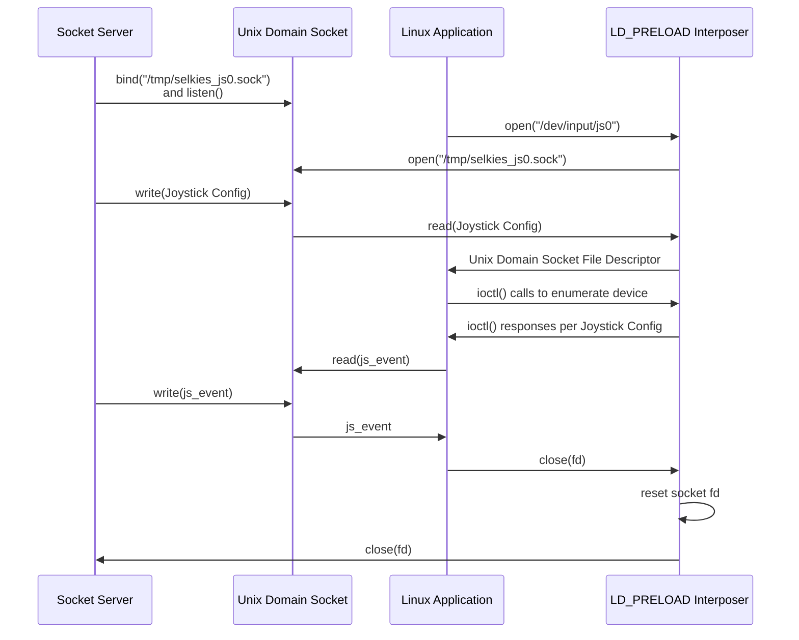

# Selkies Joystick (Gamepad) Interposer

An `LD_PRELOAD` library for interposing application calls to open a Linux joystick/gamepad device and pass data through a unix domain socket.

This allows the Selkies-GStreamer WebRTC interface to pass gamepad events over the WebRTC `RTCDataChannel`, and translate them to joystick/gamepad events to emulate devices without requiring access to /dev/input/js0 or depending on kernel modules including `uinput`.

## Compiling

```bash
gcc -shared -fPIC -ldl -o selkies_joystick_interposer.so joystick_interposer.c
```

To compile the `i386` library for Wine and other 32-bit packages, add `-m32` with the `gcc-multilib` package installed.

## Installing

1. Install to your library path (may be `/usr/lib/x86_64-linux-gnu/selkies_joystick_interposer.so` and `/usr/lib/i386-linux-gnu/selkies_joystick_interposer.so` for Ubuntu), also available as a tarball or `.deb` installer.

If using Wine with `x86_64`, both `/usr/lib/x86_64-linux-gnu/selkies_joystick_interposer.so` and `/usr/lib/i386-linux-gnu/selkies_joystick_interposer.so` are likely required.

2. The following paths are required to exist for the Joystick Interposer to pass the joystick/gamepad input to various applications:

```bash
sudo mkdir -pm1777 /dev/input
sudo touch /dev/input/js0 /dev/input/js1 /dev/input/js2 /dev/input/js3
sudo touch /dev/input/event1000 /dev/input/event1001 /dev/input/event1002 /dev/input/event1003
sudo chmod 777 /dev/input/js* /dev/input/event*
```

3. Use the below command before running your target application as well as Selkies-GStreamer for the interposer library to intercept joystick/gamepad events (the single quotes are required in the first line).

```bash
export SELKIES_INTERPOSER='/usr/$LIB/selkies_joystick_interposer.so'
export LD_PRELOAD="${SELKIES_INTERPOSER}${LD_PRELOAD:+:${LD_PRELOAD}}"
```

Otherwise, if you only need one architecture, the below is an equivalent command.

```bash
export LD_PRELOAD="/usr/lib/x86_64-linux-gnu/selkies_joystick_interposer.so${LD_PRELOAD:+:${LD_PRELOAD}}"
```

You can replace `/usr/$LIB/selkies_joystick_interposer.so` with any non-root path of your choice if using the `.tar.gz` tarball. Make sure the correct `selkies_joystick_interposer.so` is installed in that path.

## Testing

1. Start the Python joystick emulator:

```bash
python3 js-interposer-test.py
```

This creates a new unix domain socket at `/tmp/selkies_js0.sock` and simulates joystick button presses and axis motion when a connection from the interposer is detected.

2. Run `jstest` with the interposer library (`LD_PRELOAD` environment variable path can be set as adequate):

```bash
LD_PRELOAD='/usr/$LIB/selkies_joystick_interposer.so' jstest /dev/input/js0
```

# Tested SDL versions

- `2.30.0`: Ubuntu 24.04 - Working
- `2.0.20`: Ubuntu 22.04 - Works when `SDL_JOYSTICK_DISABLE_UDEV=1`

# Unix Domain Socket API

The interposer uses a Unix Domain Socket to pass virtual Joystick events from the Socket Server to the Linux application. The Socket Server is responsible for creating the Unix Domain Socket and listening for connections to `/tmp/selkies_js*.sock` or `/tmp/selkies_event*.sock` for raw joystick or evdev joystick devices respectively.
Note that both types of joysticks are supported and they have different message structures, so separate sockets are required.

When an application attempts to open a joystick device at either `/dev/input/js*` or `/dev/input/event*` the interposer intercepts the `open()` syscall and instead opens the Unix Domain Socket paired with the device and returns the file descriptor for the socket to the application.

When the Socket Server receives a new socket connection it must send the joystick configuration to the interposer before writing any other data. After that, any data written to the socket is read directly by the application that opened the joystick device.

Note that the Socket Server serving the Unix Domain Socket must be started first, before any applications try to use the joystick device.



## Joystick Configuration Message

The Joystick Config data structure that the Socket Server sends to the Interposer on first connect is defined below.

```C
typedef struct
{
    char name[255];        // Name of the controller
    uint16_t num_btns;     // Number of buttons
    uint16_t num_axes;     // Number of axes
    uint16_t btn_map[512]; // Button map
    uint8_t axes_map[64];  // axes map
} js_config_t;
```

## Socket `js_event` Message

After the configuration is written to the `/tmp/selkies_js*` socket, standard linux `js_event` data structures should be written to the socket.
These structures are defined here: https://www.kernel.org/doc/Documentation/input/joystick-api.txt

```C
struct js_event {
  __u32 time;     /* event timestamp in milliseconds */
  __s16 value;    /* value */
  __u8 type;      /* event type */
  __u8 number;    /* axis/button number */
};
```

## Socket `input_event` Message

After the configuration is written to the `/tmp/selkies_event*.sock` socket, standard linux `input_event` data structures should be written to the socket.

The `input_event` structures are defined here:
https://www.kernel.org/doc/Documentation/input/joystick-api.txt

```C
struct input_event {
  struct timeval time;
  unsigned short type;
  unsigned short code;
  unsigned int value;
};
```
