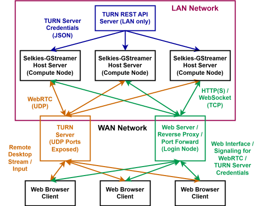

# Components

## Component Structure

Selkies-GStreamer is composed of various mandatory and optional components.

**Refer to [Getting Started](start.md) on how you can get on board.**

### Mandatory Components

There are currently three mandatory components in Selkies-GStreamer.

All mandatory components are available for download from the [Releases](https://github.com/selkies-project/selkies-gstreamer/releases) for the latest stable version.

For the most recent unreleased commit, download from the [GitHub Actions Workflow Runs](https://github.com/selkies-project/selkies-gstreamer/actions) `Build & publish all images` Build Artifacts (under `Artifacts (Produced during runtime)`) for each commit from the `main` branch. Build Artifacts can also be downloaded using the [GitHub CLI](https://cli.github.com) command [`gh run download`](https://cli.github.com/manual/gh_run_download).

#### Conda Toolchain:

Our [reference portable distribution toolchain](/addons/conda) is compiled with the distribution-neutral [Conda](https://conda-forge.org) build toolchain, distributing all three mandatory components as well as portable versions of most dependencies in a tarball.

Pre-built `x86_64` portable distributions for **any Linux distribution with `glibc ≥ 2.17`** (CentOS 7 or newer) are available with the name **`selkies-gstreamer-portable-${SELKIES_VERSION}_amd64.tar.gz`** for download in the [Releases](https://github.com/selkies-project/selkies-gstreamer/releases) for the latest stable version.

For the most recent unreleased commit, download from the [GitHub Actions Workflow Runs](https://github.com/selkies-project/selkies-gstreamer/actions) `Build & publish all images` **`conda_linux-amd64`** Build Artifact (under `Artifacts (Produced during runtime)`) for each commit from the `main` branch.

Alternatively, copy the pre-built `x86_64` portable distribution build from the container image (change `main` with `latest` for the latest stable release):

```bash
docker create --platform="linux/amd64" --name ghcr.io/selkies-project/selkies-gstreamer/conda:main
docker cp conda:/opt/selkies-gstreamer-latest.tar.gz /tmp/selkies-gstreamer-latest.tar.gz
docker rm conda
cd /opt && sudo tar -xzf /tmp/selkies-gstreamer-latest.tar.gz && rm -f /tmp/selkies-gstreamer-latest.tar.gz
# Run Selkies-GStreamer portable distribution
/opt/selkies-gstreamer/bin/selkies-gstreamer-run
```

Otherwise (for different system architectures), you can build your own portable distribution (currently tested with `aarch64` and `ppc64le`).

#### Python Application:

The term `host` or `server` refers to the [Python Components](/src/selkies_gstreamer) across this documentation.

The [Python Components](/src/selkies_gstreamer) are responsible for the host server backend, capturing and encoding the host screen and audio, receiving input signals and communicating other data (including the clipboard) between the client and the host, and establishing the WebRTC (with RTP underneath) connection to the client.

Host screen video and audio are transported using the WebRTC `MediaStream` interface, and other data are transported using the WebRTC `DataChannel` interface.

The architecture-independent components are available with the name **`selkies_gstreamer-${SELKIES_VERSION}-py3-none-any.whl`** for download in the [Releases](https://github.com/selkies-project/selkies-gstreamer/releases) for the latest stable version.

For the most recent unreleased commit, download from the [GitHub Actions Workflow Runs](https://github.com/selkies-project/selkies-gstreamer/actions) `Build & publish all images` **`py-build_linux-amd64`** Build Artifact (under `Artifacts (Produced during runtime)`) for each commit from the `main` branch.

Alternatively, copy the Python Wheel file from the build container image (DO NOT change the platform in non-`x86_64` architectures, install [binfmt](https://github.com/tonistiigi/binfmt) instead, and change `main` with `latest` for the latest stable release):

```bash
docker create --platform="linux/amd64" --name selkies-py ghcr.io/selkies-project/selkies-gstreamer/py-build:main
docker cp selkies-py:/opt/pypi/dist/selkies_gstreamer-0.0.0.dev0-py3-none-any.whl /tmp/selkies_gstreamer-0.0.0.dev0-py3-none-any.whl
docker rm selkies-py
sudo PIP_BREAK_SYSTEM_PACKAGES=1 pip3 install --no-cache-dir --force-reinstall /tmp/selkies_gstreamer-0.0.0.dev0-py3-none-any.whl
rm -f /tmp/selkies_gstreamer-0.0.0.dev0-py3-none-any.whl
```

One other alternative way to install the Python application components from the most recent unreleased commit:

```bash
git clone https://github.com/selkies-project/selkies-gstreamer.git
cd selkies-gstreamer
export PIP_BREAK_SYSTEM_PACKAGES=1
pip install --no-cache-dir --force-reinstall .
```

#### Web Application:

The term `client` refers to the [Web Components](/addons/gst-web) across this documentation.

The [Web Components](/addons/gst-web) are responsible the web browser interface that you see when you use Selkies-GStreamer.

They receive and display the received screen and audio within the web browser, detect input signal and other data (including the clipboard) from the user, then send them to the host server backend.

They also handle remote cursors with the Pointer Lock API that allows you to correctly control interactive applications and games, and also modify the SDP (responsible for negotiating the stream between the host and the client) so that hidden web browser features can be utilized.

WebRTC enables web browser clients to decode the stream using GPU hardware acceleration, as well as GPU-accelerated stream encoding from the host.

The architecture-independent components are available with the name **`selkies-gstreamer-web_${SELKIES_VERSION}.tar.gz`** for download in the [Releases](https://github.com/selkies-project/selkies-gstreamer/releases) for the latest stable version.

For the most recent unreleased commit, download from the [GitHub Actions Workflow Runs](https://github.com/selkies-project/selkies-gstreamer/actions) `Build & publish all images` **`gst-web_linux-amd64`** Build Artifact (under `Artifacts (Produced during runtime)`) for each commit from the `main` branch.

Alternatively, install the web interface components to the container image (DO NOT change the platform in non-`x86_64` architectures, install [binfmt](https://github.com/tonistiigi/binfmt) instead, and change `main` with `latest` for the latest stable release):

```bash
docker create --platform="linux/amd64" --name gst-web ghcr.io/selkies-project/selkies-gstreamer/gst-web:main
sudo docker cp gst-web:/usr/share/nginx/html /opt/gst-web
docker rm gst-web
```

One other alternative way to install the web interface components from the most recent unreleased commit (replace `INSTALL_DIR=/opt/gst-web` with your own directory):

```bash
git clone https://github.com/selkies-project/selkies-gstreamer.git
cd selkies-gstreamer/addons/gst-web
sudo `INSTALL_DIR=/opt/gst-web` ./install.sh
```

#### GStreamer:

[GStreamer](https://gstreamer.freedesktop.org) "is a library for constructing graphs of media-handling components. The applications it supports range from simple Ogg/Vorbis playback, audio/video streaming to complex audio (mixing) and video (non-linear editing) processing." GStreamer is likely inside your smart TV, car infotainment system, or the digital street signage or surveillance camera near you, as well as many media players and video editing software.

GStreamer is responsible for the actual heavy lifting of Selkies-GStreamer, starting from capturing and encoding the host screen and audio to transporting the stream and other data between the host and the client web browser using WebRTC. GStreamer can be installed from your Linux distribution (but the required newest version may not be available), be [built for your distribution](/addons/gstreamer), or be compiled and distributed in portable form with [Conda](/addons/conda).

Check [GStreamer Components](#gstreamer-components) for more details.

Pre-built `x86_64` GStreamer components for Ubuntu are available with the name (fill in the OS version `DISTRIB_RELEASE` such as `24.04`, `22.04`) **`gstreamer-selkies_gpl_${SELKIES_VERSION}_ubuntu${DISTRIB_RELEASE}_amd64.tar.gz`** for download in the [Releases](https://github.com/selkies-project/selkies-gstreamer/releases) for the latest stable version.

For the most recent unreleased commit, download from the [GitHub Actions Workflow Runs](https://github.com/selkies-project/selkies-gstreamer/actions) `Build & publish all images` **`gstreamer-ubuntu${DISTRIB_RELEASE}_linux-amd64`** Build Artifact (under `Artifacts (Produced during runtime)`) for each commit from the `main` branch.

Alternatively, copy the pre-built `x86_64` GStreamer build from the container image and move it to `/opt/gstreamer` or your directory of choice (change `main` with `latest` for the latest stable release):

```bash
docker create --platform="linux/amd64" --name gstreamer ghcr.io/selkies-project/selkies-gstreamer/gstreamer:main-ubuntu${DISTRIB_RELEASE}
sudo docker cp gstreamer:/opt/gstreamer /opt/gstreamer
docker rm gstreamer
```

Otherwise (for different operating system distributions or system architectures), you can build your own GStreamer version as long as it is the latest possible stable version.

### Optional Components

These components are not required for Selkies-GStreamer, but may be required in specific cases of deployments or preferences. Recommended to read nonetheless.

#### Joystick Interposer:

The [Joystick Interposer](/addons/js-interposer) is a special library which allows the usage of joysticks or gamepads inside unprivileged containers (most of the occasions with shared Kubernetes clusters or HPC clusters), where host kernel devices required for creating a joystick interface are not available. It uses a `LD_PRELOAD` hack to intercept `uinput` input commands from joysticks or gamepads into Selkies-GStreamer (much like how [VirtualGL](https://github.com/VirtualGL/virtualgl) intercepts OpenGL commands).

Pre-built `x86_64` and `aarch64` joystick interposer components for Ubuntu are available with the name (fill in the OS version `DISTRIB_RELEASE` such as `24.04`, `22.04`, Ubuntu-style architecture `ARCH` such as `amd64` and `arm64`) **`selkies-js-interposer_${SELKIES_VERSION}_ubuntu${DISTRIB_RELEASE}_${ARCH}.tar.gz`** or **`selkies-js-interposer_${SELKIES_VERSION}_ubuntu${DISTRIB_RELEASE}_${ARCH}.deb`** for download in the [Releases](https://github.com/selkies-project/selkies-gstreamer/releases) for the latest stable version.

For the most recent unreleased commit, download from the [GitHub Actions Workflow Runs](https://github.com/selkies-project/selkies-gstreamer/actions) `Build & publish all images` **`js-interposer-ubuntu${DISTRIB_RELEASE}-tar.gz_linux-${ARCH}`** or **`js-interposer-ubuntu${DISTRIB_RELEASE}-deb_linux-${ARCH}`** Build Artifact (under `Artifacts (Produced during runtime)`) for each commit from the `main` branch.

Alternatively, copy and install the pre-built Joystick Interposer build (change `--platform=` to `linux/arm64` for `aarch64`, and change `main` with `latest` and `0.0.0` to the release version for the latest stable release):

```bash
docker create --platform="linux/amd64" --name js-interposer ghcr.io/selkies-project/selkies-gstreamer/js-interposer:main-ubuntu${DISTRIB_RELEASE}
docker cp js-interposer:/opt/selkies-js-interposer_0.0.0.deb /tmp/selkies-js-interposer.deb
docker rm js-interposer
sudo apt-get update && sudo apt-get install --no-install-recommends -y /tmp/selkies-js-interposer.deb
rm -f /tmp/selkies-js-interposer.deb
```

To retrieve the `.tar.gz` tarball instead of the `.deb` installer:

```bash
docker create --platform="linux/amd64" --name js-interposer ghcr.io/selkies-project/selkies-gstreamer/js-interposer:main-ubuntu${DISTRIB_RELEASE}
docker cp js-interposer:/opt/selkies-js-interposer_0.0.0.tar.gz /opt/selkies-js-interposer_0.0.0.tar.gz
docker rm js-interposer
```

The following paths are required to exist for the Joystick Interposer to pass the joystick/gamepad input to various applications:

```bash
sudo mkdir -pm755 /dev/input
sudo touch /dev/input/js0 /dev/input/js1 /dev/input/js2 /dev/input/js3
```

The following environment variables are required to be set in the environment each application is being run in to receive the joystick/gamepad input.

```bash
export SELKIES_INTERPOSER='/usr/$LIB/selkies_joystick_interposer.so'
export LD_PRELOAD="${SELKIES_INTERPOSER}${LD_PRELOAD:+:${LD_PRELOAD}}"
export SDL_JOYSTICK_DEVICE=/dev/input/js0
```

You can replace `/usr/$LIB/selkies_joystick_interposer.so` with any non-root path of your choice if using the `.tar.gz` tarball.

Check the [Joystick Interposer README.md](/addons/js-interposer/README.md) documentation for usage instruction and compiling information on other platforms.

Check the following links for explanations of similar, but different attempts, for reference:

<https://github.com/Steam-Headless/dumb-udev>

<https://github.com/games-on-whales/inputtino>

<https://github.com/games-on-whales/inputtino/tree/stable/src/uhid>

<https://games-on-whales.github.io/wolf/stable/dev/fake-udev.html>

<https://github.com/games-on-whales/wolf/tree/stable/src/fake-udev>

#### Example Container:

The [Example Container](/addons/example) is the reference minimal-functionality container developers can base upon, or test Selkies-GStreamer quickly. The bare minimum Xfce4 desktop environment is installed together with Firefox, as well as an embedded TURN server inside the container for quick WebRTC firewall traversal.

Run the Docker®/Podman container built from the [`Example Dockerfile`](/addons/example/Dockerfile), then connect to port **8080** of your Docker®/Podman host to access the web interface (Username: **`ubuntu`**, Password: **`password`**, **change `DISTRIB_RELEASE` to `24.04`, `22.04`, or `20.04`, and replace `main` to `latest` for the latest stable release**):

```bash
docker run --pull=always --name selkies -it -d --rm -p 8080:8080 -p 3478:3478 ghcr.io/selkies-project/selkies-gstreamer/gst-py-example:main-ubuntu${DISTRIB_RELEASE}
```

Port 3478 is the port for the internal TURN server which is needed to route WebRTC through restrictive networks.

Otherwise, you will need to use an external STUN/TURN server capable of `srflx` or `relay` type ICE connections if you use this in a container WITHOUT host networking (add `--network=host` to the Docker® command to enable host networking and work around this requirement if your server is not behind NAT).

**Follow the instructions from [coTURN](#coturn) and [WebRTC and Firewall Issues](firewall.md) in order to make the container work using an external TURN server.**

#### coTURN:

Note that there are other different TURN server implementations other than coTURN, some of which are also compatible with Windows and MacOS.

The [coTURN Container](/addons/coturn) is a reference container which provides the [coTURN](https://github.com/coturn/coturn) TURN server. Other than options including `-e TURN_SHARED_SECRET=`, `-e TURN_REALM=`, `-e TURN_PORT=`, `-e TURN_MIN_PORT=`, and `-e TURN_MAX_PORT=`, add more command-line options in `-e EXTRA_ARGS=`.

Run the Docker®/Podman container built from the [`coTURN Dockerfile`](/addons/coturn/Dockerfile) (replace `main` to `latest` for the latest stable release**):

```bash
docker run --pull=always --name coturn -it -d --rm -e TURN_SHARED_SECRET=n0TaRealCoTURNAuthSecretThatIsSixtyFourLengthsLongPlaceholdPlace -e TURN_REALM=example.com -e TURN_PORT="3478" -e TURN_MIN_PORT="49152" -e TURN_MAX_PORT="65535" -p 3478:3478 -p 49152-65535:49152-65535 -p 49152-65535:49152-65535/udp ghcr.io/selkies-project/selkies-gstreamer/coturn:main
```

Check the [coTURN documentation](https://github.com/coturn/coturn/blob/master/README.turnserver) for specific usage directions.

For standalone self-hosted coTURN servers, a minimal barebones configuration for `/etc/turnserver.conf` is available below, where options are also all available as command-line options (check the [coTURN example configuration](https://github.com/coturn/coturn/blob/master/examples/etc/turnserver.conf) for more information):

```conf
listening-ip=0.0.0.0
listening-ip=::

listening-port=3478

# Choose one (mandatory):

# When using static auth secret and/or TURN REST API authentication:
# use-auth-secret
# static-auth-secret=n0TaRealCoTURNAuthSecretThatIsSixtyFourLengthsLongPlaceholdPlace

# When using traditional long-term credential authentication:
# lt-cred-mech
# user=username1:password1
# user=username2:password2

realm=turn.myinfrastructure.io

# Specify minimum and maximum ports to allocate for coTURN TURN relay ports
min-port=49152
max-port=49172

log-file=stdout
pidfile=/tmp/turnserver.pid
userdb=/tmp/turnserver.db

# Certificate paths if TURN over TLS is to be used
# cert=/ssl/tls.crt
# pkey=/ssl/tls.key

# Prometheus statistics
prometheus

# Add `allow-loopback-peers` if coTURN and Selkies-GStreamer are on the same node
no-software-attribute
no-rfc5780
no-stun-backward-compatibility
response-origin-only-with-rfc5780
```

For single-user environments, traditional long-term credential authentication is the easiest, but multi-user environments likely need TURN REST API authentication with a static auth secret.

Please read the [TURN-REST](#turn-rest) section for the difference between static auth secret/TURN REST API authentication and traditional long-term credential authentication.

#### TURN-REST:

**The below is an advanced concept for multi-user environments.**



A TURN server is required with WebRTC when both the host and the client are under Symmetric NAT or are each under Port Restricted Cone NAT and Symmetric NAT.

In easier words, if both the host and client are behind restrictive firewalls, the web interface and signaling connection (delivered using HTTP(S) and WebSocket) are delivered and established, but the video and audio stream (delivered using WebRTC) does not establish. In this case, the TURN server relays the WebRTC stream so that the host and client can send the video and audio stream, as well as other data.

The recommended multi-user TURN server authentication mechanism is the [time-limited short-term credential/TURN REST API mechanism](https://datatracker.ietf.org/doc/html/draft-uberti-behave-turn-rest-00), where there is a single [Shared Secret](https://github.com/coturn/coturn/blob/master/README.turnserver) that is never exposed externally (only the TURN-REST Container and the coTURN TURN server know), but instead authenticates WebRTC clients (which are Selkies-GStreamer hosts and clients) based on generated credentials which are valid for only a short time (typically 24 hours).

The [TURN-REST Container](/addons/turn-rest) is an easy way to distribute short-term TURN server authentication credentials and the information of the TURN server based on the REST API to many Selkies-GStreamer host instances, particularly when behind a local area network (LAN), which may or may not have restricted firewalls.

Using the `selkies-gstreamer --turn_rest_uri=` option or `SELKIES_TURN_REST_URI` environment variable, the Selkies-GStreamer host periodically queries a URL such as `https://turn-rest.myinfrastructure.io/myturnrest` or `http://192.168.0.10/myturnrest`.

This URL is ideally behind a local area network (LAN) inaccessible from the outside and only accessible to the Python hosts inside the LAN, or alternatively behind authentication using any web server or reverse proxy, if accessible from the outside. This information is periodically sent to the web client (that is also preferably behind authentication with HTTP Basic Authentication or a web server/reverse proxy) through HTTP(S), thus the TURN server information and credentials being propagated to both the Python host and the web client without exposing the TURN server information outside.

Because the time-limited TURN credentials automatically expire after some time, they are not useful even if they are leaked outside, as long as the pathway to the air-gapped or authenticated TURN-REST Container REST HTTP endpoint is not exposed plainly to the internet. [app.py](/addons/turn-rest/app.py) may also be hosted standalone without a container using the same startup command in the [Dockerfile](/addons/turn-rest/Dockerfile).

The TURN-REST Container (or similarly, Kubernetes Pod) should be triggered with the Docker®/Podman options `-e TURN_SHARED_SECRET=`, `-e TURN_HOST=`, `-e TURN_PORT=`, `-e TURN_PROTOCOL=`, `-e TURN_TLS=`, where the options are dependent on the TURN server configuration of [coTURN](#coturn) or other TURN server implementations.

Run the Docker®/Podman container built from the [`TURN-REST Dockerfile`](/addons/turn-rest/Dockerfile) (replace `main` to `latest` for the latest stable release**):

```bash
docker run --pull=always --name turn-rest -it -d --rm -e TURN_SHARED_SECRET=n0TaRealCoTURNAuthSecretThatIsSixtyFourLengthsLongPlaceholdPlace -e TURN_HOST=turn.myinfrastructure.io -e TURN_PORT="3478" -e TURN_PROTOCOL=udp -e TURN_TLS="false" -p 8008:8008 ghcr.io/selkies-project/selkies-gstreamer/turn-rest:main
```

---
Alternative methods of TURN server authentication without using TURN REST API authentication include two other different ways:

First, directly inputting the TURN Shared Secret using the `selkies-gstreamer --turn_shared_secret=` option or the `SELKIES_TURN_SHARED_SECRET` environment variable (only for when the user running Selkies-GStreamer is trusted to unrestricted TURN server access for arbitrary purposes).

Second, using traditional long-term credential authentication with fixed username and password combinations using the `selkies-gstreamer --turn_username=TURN_USERNAME --turn_password=TURN_PASSWORD`, or both the environment variables `SELKIES_TURN_USERNAME` and `SELKIES_TURN_PASSWORD` (also only for when the user running Selkies-GStreamer is trusted to unrestricted TURN server access for arbitrary purposes).

Note that both methods require additionally manually specifying the `selkies-gstreamer --turn_host=TURN_HOST --turn_port=TURN_PORT --turn_protocol=TURN_PROTOCOL --turn_tls=TURN_TLS` options or the environment variables `SELKIES_TURN_HOST`, `SELKIES_TURN_PORT`, `SELKIES_TURN_PROTOCOL`, and `SELKIES_TURN_TLS`, in addition to the below options, because, unlike the TURN REST API method, information of the TURN server is not available together with the credentials through the REST API.

Conversely, using the `selkies-gstreamer --turn_rest_uri=` option or `SELKIES_TURN_REST_URI` environment variable is sufficient when using the TURN REST API method, because the TURN-REST Container passes TURN server information with the credentials.

#### coTURN-Web:

The [coTURN-Web Container](/addons/coturn-web) is a legacy component meant to provide similar capabilities to the [TURN-REST Container](/addons/turn-rest) for the Google Kubernetes Engine, mostly old remnants from the Google era. This component may be phased out as well as the [`infra/gce`](/infra/gce) and [`infra/gke`](/infra/gke) components and `cloudbuild.yml` configurations in favor of platform-agnostic Kubernetes configurations. Contributions are welcome.

## GStreamer Components

Below are GStreamer components that are implemented and therefore used with Selkies-GStreamer. Some include environment variables or command-line options which may be used select one type of component, and others are chosen automatically based on the operating system or configuration. This section is to be continuously updated.

### Encoders

This table specifies the currently implemented video encoders and their corresponding codecs, which may be set using the environment variable `SELKIES_ENCODER` or the command-line option `--encoder=`.

**Encoders marked as "Recommended": Tested on Chromium where the encoder adds no perceptible delay or frame drops from the host encoder even with a high (> 16 Mbps) bitrate with an actively moving screen.** Note that broadband internet through 5 GHz Wi-Fi or wired ethernet are strongly recommended.

**As Selkies-GStreamer uses new GStreamer components from the latest stable GStreamer versions, GStreamer ≥ 1.22 is the current strict requirement. No support will be provided for older versions, but you can [build your own latest GStreamer version](#gstreamer) in older distributions or use the [portable Conda distribution](#conda-toolchain).**

| Plugin (set `SELKIES_ENCODER` or `--encoder=` to) | Codec | Acceleration | Operating Systems | Browsers | Main Dependencies | Notes |
|---|---|---|---|---|---|---|
| [`nvh264enc`](https://gstreamer.freedesktop.org/documentation/nvcodec/nvh264enc.html) | H.264 AVC | NVIDIA GPU | All | All Major | NVRTC, `libnvidia-encode` | **Recommended**, [Requires NVENC - Encoding H.264 (AVCHD)](https://developer.nvidia.com/video-encode-and-decode-gpu-support-matrix-new) |
| [`vah264enc`](https://gstreamer.freedesktop.org/documentation/va/vah264enc.html) | H.264 AVC | AMD, Intel GPU | All | All Major | VA-API Driver, `libva` | Requires supported GPU |
| [`x264enc`](https://gstreamer.freedesktop.org/documentation/x264/index.html) | H.264 AVC | Software | All | All Major | `x264` | **Recommended** |
| [`openh264enc`](https://gstreamer.freedesktop.org/documentation/openh264/openh264enc.html) | H.264 AVC | Software | All | All Major | `openh264` | N/A |
| [`nvh265enc`](https://gstreamer.freedesktop.org/documentation/nvcodec/nvh265enc.html) | H.265 HEVC | NVIDIA GPU | All | Safari ≥ 17.9 | NVRTC, `libnvidia-encode` | [Requires NVENC - Encoding H.265 (HEVC)](https://developer.nvidia.com/video-encode-and-decode-gpu-support-matrix-new) |
| [`vah265enc`](https://gstreamer.freedesktop.org/documentation/va/vah265enc.html) | H.265 HEVC | AMD, Intel GPU | All | Safari ≥ 17.9 | VA-API Driver, `libva` | Unstable, Requires supported GPU |
| [`x265enc`](https://gstreamer.freedesktop.org/documentation/x265/index.html) | H.265 HEVC | Software | All | Safari ≥ 17.9 | `x265` | Unstable |
| [`vp8enc`](https://gstreamer.freedesktop.org/documentation/vpx/vp8enc.html) | VP8 | Software | All | All Major | `libvpx` | **Recommended under 2K resolution but not with constrained network** |
| [`vavp9enc`](https://gstreamer.freedesktop.org/documentation/va/vavp9enc.html) | VP9 | AMD, Intel GPU | All | All Major | VA-API Driver, `libva` | Unstable, Requires supported GPU and GStreamer ≥ 1.25 |
| [`vp9enc`](https://gstreamer.freedesktop.org/documentation/vpx/vp9enc.html) | VP9 | Software | All | All Major | `libvpx` | **Recommended but not with constrained network** |
| [`nvav1enc`](https://gstreamer.freedesktop.org/documentation/nvcodec/nvav1enc.html) | AV1 | NVIDIA GPU | All | Chromium-based, Safari | NVRTC, `libnvidia-encode`, [`gst-plugins-rs`](https://gitlab.freedesktop.org/gstreamer/gst-plugins-rs) | Unstable, [Requires NVENC - Encoding AV1](https://developer.nvidia.com/video-encode-and-decode-gpu-support-matrix-new) and GStreamer ≥ 1.25 |
| [`vaav1enc`](https://gstreamer.freedesktop.org/documentation/va/vaav1enc.html) | AV1 | AMD, Intel GPU | All | Chromium-based, Safari | VA-API Driver, `libva`, [`gst-plugins-rs`](https://gitlab.freedesktop.org/gstreamer/gst-plugins-rs) | Unstable, Requires supported GPU and GStreamer ≥ 1.24 |
| [`svtav1enc`](https://gstreamer.freedesktop.org/documentation/svtav1/svtav1enc.html) | AV1 | Software | All | Chromium-based, Safari | `svt-av1` ≥ 1.1, [`gst-plugins-rs`](https://gitlab.freedesktop.org/gstreamer/gst-plugins-rs) | NOT WORKING, Conda or Ubuntu ≥ 24.04 |
| [`av1enc`](https://gstreamer.freedesktop.org/documentation/aom/av1enc.html) | AV1 | Software | All | Chromium-based, Safari | `aom`, [`gst-plugins-rs`](https://gitlab.freedesktop.org/gstreamer/gst-plugins-rs) | Unstable, Conda or Ubuntu ≥ 22.04 |
| [`rav1enc`](https://gstreamer.freedesktop.org/documentation/rav1e/index.html) | AV1 | Software | All | Chromium-based, Safari | [`gst-plugins-rs`](https://gitlab.freedesktop.org/gstreamer/gst-plugins-rs) | Unstable |

### Video Color Converters

This table specifies the currently implemented video frame converters used to convert the YUV formats from `BGRx` to `I420` or `NV12`, which are automatically decided based on the encoder support.

| Plugin | Encoders | Acceleration | Operating Systems | Main Dependencies | Notes |
|---|---|---|---|---|---|
| [`cudaconvert`](https://gstreamer.freedesktop.org/documentation/nvcodec/cudaconvert.html) | `nvh264enc`, `nvh265enc`, `nvav1enc` | NVIDIA GPU | All | NVRTC | N/A |
| [`vapostproc`](https://gstreamer.freedesktop.org/documentation/va/vapostproc.html) | `vah264enc`, `vah265enc`, `vavp9enc`, `vaav1enc` | AMD, Intel GPU | All | VA-API Driver, `libva` | N/A |
| [`videoconvert`](https://gstreamer.freedesktop.org/documentation/videoconvertscale/videoconvert.html) | `x264enc`, `openh264enc`, `x265enc`, `vp8enc`, `vp9enc`, `svtav1enc`, `av1enc`, `rav1enc` | Software | All | N/A | N/A |

### Display Capture Interfaces

This table specifies the currently supported display interfaces and how each plugin selects each video device.

| Plugin | Device Selector | Display Interfaces | Input Interfaces | Operating Systems | Main Dependencies | Notes |
|---|---|---|---|---|---|---|
| [`ximagesrc`](https://gstreamer.freedesktop.org/documentation/ximagesrc/index.html) | `DISPLAY` environment | X.Org / X11 | [`Xlib`](https://github.com/python-xlib/python-xlib) w/ [`pynput`](https://github.com/moses-palmer/pynput) | Linux | Various | N/A |

### Audio Encoders

This table specifies the currently implemented audio encoders and their corresponding codecs.

Opus is currently the only adequate full-band WebRTC audio media codec supported in web browsers by specification.

| Plugin | Codec | Operating Systems | Browsers | Main Dependencies | Notes |
|---|---|---|---|---|---|
| [`opusenc`](https://gstreamer.freedesktop.org/documentation/opus/opusenc.html) | Opus | All | All Major | `libopus` | N/A |

### Audio Capture Interfaces

This table specifies the currently supported audio interfaces and how each plugin selects each audio device.

| Plugin | Device Selector | Audio Interfaces | Operating Systems | Main Dependencies | Notes |
|---|---|---|---|---|---|
| [`pulsesrc`](https://gstreamer.freedesktop.org/documentation/pulseaudio/pulsesrc.html) | `PULSE_SERVER` environment | PulseAudio or PipeWire-Pulse | Linux | `libpulse` | N/A |

### Stream Transport Protocols

This table specifies the currently supported transport protocol components.

| Plugin | Protocols | Operating Systems | Browsers | Main Dependencies | Notes |
|---|---|---|---|---|---|
| [`webrtcbin`](https://gstreamer.freedesktop.org/documentation/webrtc/index.html) | [WebRTC](https://webrtc.org) | All | All Major | Various | N/A |
